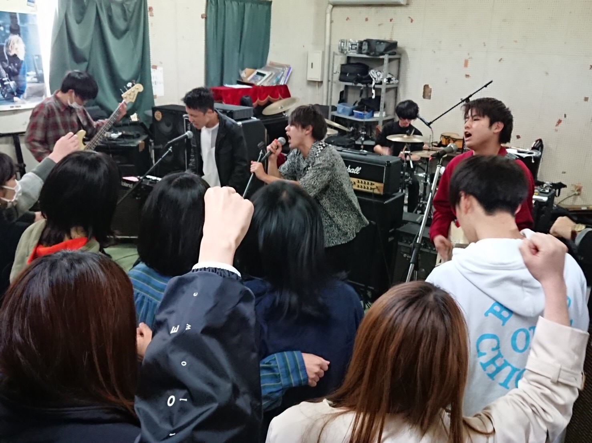

# About

大学・大学院で情報工学を学び，NLPを専門にしています！
今後は大学で学んだNLPの知識を用いたシステムの設計を行っていきたいです
学生時代はバンド活動をしていました！

<iframe width="560" height="315" src="https://www.youtube.com/embed/AjiKBIs5xyo?controls=0" frameborder="0" allow="accelerometer; autoplay; encrypted-media; gyroscope; picture-in-picture" allowfullscreen></iframe>

<a class="twitter-timeline" data-width="400" data-height="600" data-theme="dark" href="https://twitter.com/orehdare?ref_src=twsrc%5Etfw">Tweets by orehdare</a> 

<iframe src="https://www.openprocessing.org/sketch/898160/embed/" width="400" height="300"></iframe>

## Profile
- kunifu
- 岡山
- NLP,ML,DL,数理最適化,Web開発,システム運用,監視

# Skills

## OS
- Ubuntu18.04
- CentOS7
- MacOS
- Windows

## Languages
- Python3.x (経験年数: 2年)
- HTML (経験年数: 1年)
- CSS (経験年数: 1年)
- JavaScript (経験年数: 1年)
- SQL (経験年数: 1年)
- C (経験年数: 3年)

## Engine,Frameworks

### 機械学習関連
- Pytorch,Tensorflow,scikit-learn
- numpy,pandas,matplotlibなど

### Web関連
- Node.js
- Express
- jQuery
- Reactなど

## Tool,MiddleWare
- Git
- sqlite,MySQL,PostgreSQLなど

## Works
これから載せていく予定です（研究以外のもの）

# Contact
- [Twitter](https://twitter.com/orehdare)
- [LinkedIn](https://www.linkedin.com/in/daiki-kou-580781191/)
- [Wantedly](https://www.wantedly.com/users/128453632)
- [Qiita](https://qiita.com/orehdare)

# History
- 2020年 富士ゼロックス　インターン
- 2019年 ソニー　インターン

